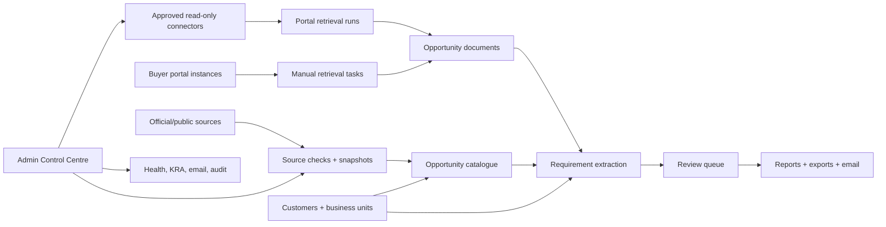

# Architecture Blueprint

This document describes the current Data Intelligence Portal build and the intended production evolution.

## Current MVP Architecture

## Current Stack

- Python 3.12
- FastAPI
- SQLModel / SQLAlchemy
- SQLite for local and live-test MVP persistence
- PostgreSQL-compatible `DATABASE_URL` support with Alembic migration scaffolding for production-shaped deployments
- Jinja2 server-rendered HTML
- HTMX-ready templates with minimal vanilla CSS
- YAML-backed source, platform, extraction, workflow and KRA configuration
- pytest
- Docker Desktop
- Azure Container Apps live-test path

## Runtime Areas

| Area | Current Implementation |
| --- | --- |
| Opportunity Inbox | Simplified user-facing source-to-inbox dashboard with matched opportunities, KRA signals and report downloads. |
| Workflow | Live operating workflow with source, portal, review and report metrics. |
| Admin | Consolidated health dashboard, autonomous workflow runner, source/KRA/audit links and email configuration. |
| Customers | Customer records, business-unit links, aliases, buying entities and notes. |
| Sources | Approved public source catalogue and source-change snapshots. |
| Portals | Buyer portal instances, retrieval mode, account reference, tasks and connectors. |
| Opportunities | Opportunity catalogue linked to customers, sources, business units and documents. |
| Documents | Document metadata and permitted text extraction. |
| Requirements | Extracted requirement themes and quality questions pending review. |
| Reports | Executive intelligence packs, admin automation run logs, PDF/Markdown/HTML/JSON/text exports and controlled email delivery. |
| Audit | MVP event log for key create/update/delete and automation events. |

## Key Code Modules

| Module | Purpose |
| --- | --- |
| `app/main.py` | FastAPI app construction, lifespan, static files, persistence middleware and router registration. |
| `app/routes/` | Modular FastAPI routers for dashboard, admin, customers, sources, portals, opportunities, requirements, KRA, reports and audit pages. |
| `app/route_utils.py` | Shared template context, pagination, audit CRUD helpers, dashboard metrics, portal workbench helpers and admin health context. |
| `app/models.py` | Data model for customers, sources, portals, opportunities, documents, reports and audit. |
| `app/intelligence.py` | Source checks, KRA runs, deterministic parsing, extraction and optional AI-assisted summaries. |
| `app/source_connectors/` | Provider-specific official-source connectors for Contracts Finder, Find a Tender and generic approved sources. |
| `app/jobs.py` | CLI job runner for controlled source, feed, connector and admin-cycle execution. |
| `app/evaluation.py` | Offline matching evaluation harness and metrics. |
| `app/llm.py` | Small guarded OpenAI Responses API client used only when KRA live-demo settings are enabled. |
| `app/automation.py` | Admin-side full-cycle automation for packs, source refresh, KRA, review preparation, approved retrieval, report export, email and audit logging. |
| `app/portal_connectors.py` | Read-only connector guardrails and retrieval runs. |
| `app/reports.py` | Credibility-gated executive packs and separate admin run logs for PDF, Markdown, HTML, JSON and text export. |
| `app/email_service.py` | Local outbox and SMTP delivery. |
| `app/auth.py` | Local admin mode, Container Apps EasyAuth/Entra header handling and app-level role dependencies for standard, admin and auditor access. |
| `app/audit.py` | Audit event creation and compact snapshots. |
| `app/database.py` | SQLite setup, schema updates and Azure Files snapshot handling. |
| `alembic/` | Initial SQLModel metadata migration for PostgreSQL/production-shaped persistence. |
| `app/observability.py` | Request correlation ID and structured logging helpers. |
| `app/rules/` | YAML configuration for sources, platforms, KRA, extraction, feeds and workflow. |

## Data Objects

- `BusinessUnit`
- `Customer`
- `CustomerWatchProfile`
- `ProcurementSource`
- `SourceCheckSnapshot`
- `NewsFeedSource`
- `NewsFeedItem`
- `ProcurementPlatform`
- `BuyerPortalInstance`
- `PortalInformationConnector`
- `PortalRetrievalRun`
- `Opportunity`
- `OpportunityDocument`
- `DocumentRetrievalTask`
- `ExtractedRequirement`
- `ExtractedQualityQuestion`
- `KRAAgentProfile`
- `KRAResearchRun`
- `KRAFinding`
- `IntelligenceReport`
- `EmailConfiguration`
- `EmailDeliveryLog`
- `AuditEvent`

## Source Change Tracking

Each source check stores:

- source id
- query URL
- timestamp
- HTTP status
- content hash
- previous hash
- detected schema
- change type: first seen, unchanged, changed, failed
- connector status
- notes

## Portal Retrieval Model

The MVP supports:

- manual account-required retrieval tasks
- public no-key API retrieval
- API-key header/query references where provider-approved
- read-only connector runs
- requirement extraction from retrieved or manually pasted text

The MVP does not store portal passwords, automate portal login, submit expressions of interest or send customer messages.

## Deployment View

Local:

- Docker Compose
- one FastAPI container
- mounted local `./data` folder
- no cloud services
- no secrets required

Azure live-test:

- Azure Container Apps
- Microsoft Entra built-in auth
- Admin and Standard security groups
- existing Key Vault for DIP-specific secrets
- Azure Files snapshot/outbox persistence
- Container-local SQLite active DB copied to Azure Files after writes
- dedicated ACR, managed identity and Log Analytics workspace

Reusable customer deployments are supported by:

- `infra/azure/main.sub.bicep`
- `infra/azure/main.rg.bicep`
- `scripts/azure/new-customer-deployment.ps1`

## Production Evolution

Before full production use:

- move persistence to Azure Database for PostgreSQL
- run database changes through Alembic migrations
- formalise backup, restore and retention
- add immutable audit/event export
- add stronger RBAC and data governance
- add reviewed connector secrets and rotation policy
- add monitoring alerts and operational runbooks
- add private networking/WAF/Front Door decisions where required
- add deployment approvals between test and production
