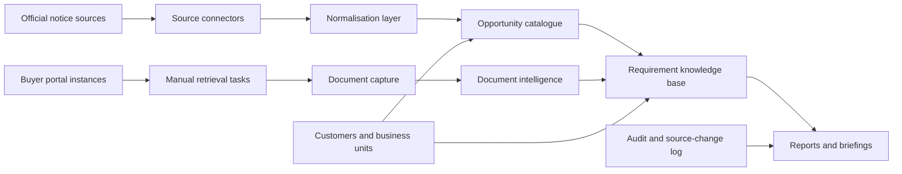

# Architecture Blueprint

## MVP Architecture

## Recommended MVP Stack

- FastAPI for application routing and API endpoints
- Jinja2 and HTMX for server-rendered, dynamic HTML
- SQLModel / SQLAlchemy for persistence
- SQLite for local MVP
- YAML configuration for source, portal and extraction rules
- pytest for service and route tests
- Docker Desktop for local deployment

This mirrors the proven lightweight pattern from the existing local app while keeping this product independent.

## Proposed Modules

- `app/main.py` - routes and page rendering
- `app/models.py` - customers, sources, opportunities, documents, requirements, reports and audit models
- `app/source_catalogue.py` - source config loading, allow-listing, source health and change snapshots
- `app/opportunity_pipeline.py` - notice parsing, normalisation, deduplication and matching
- `app/portal_intelligence.py` - platform catalogue, portal instances and manual retrieval tasks
- `app/document_intelligence.py` - document metadata, quality-question extraction and human review status
- `app/reports.py` - Markdown and HTML report generation
- `app/audit.py` - event logging
- `app/rules/` - YAML source and extraction configuration

## Key Data Objects

- `Customer`
- `BusinessUnit`
- `CustomerWatchProfile`
- `ProcurementSource`
- `SourceCheckSnapshot`
- `ProcurementPlatform`
- `BuyerPortalInstance`
- `Opportunity`
- `OpportunityDocument`
- `DocumentRetrievalTask`
- `ExtractedRequirement`
- `ExtractedQualityQuestion`
- `RequirementTheme`
- `IntelligenceReport`
- `AuditEvent`

## Source Change Tracking

Each source check should store:

- source id
- query URL
- timestamp
- HTTP status
- content hash
- previous hash
- detected schema
- change type: first seen, unchanged, changed, failed
- connector status
- notes

## Intelligence Extraction

The MVP should use deterministic text extraction first:

- keyword and phrase matching
- quality-question detection
- weighting detection
- CPV matching
- buyer alias matching
- theme classification

Later AI-assisted extraction can be added behind review controls.

## Deployment View

Local MVP:

- Docker Compose
- one FastAPI container
- mounted SQLite data volume
- no cloud services
- no secrets required

Future production:

- managed Postgres
- SSO / Entra ID
- role-based access control
- secrets manager
- immutable audit/event store
- scheduled source checks
- controlled portal automation workers
- document store such as SharePoint or object storage
