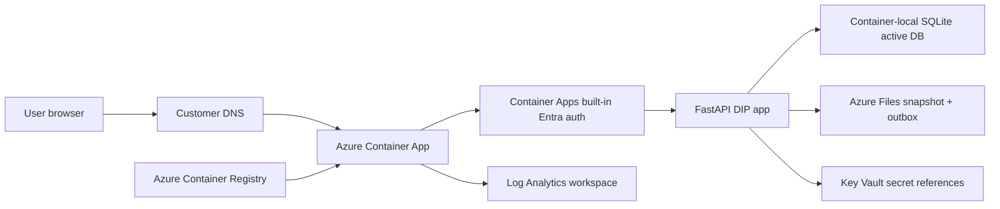

# Azure Deployment Guide

This guide explains how to deploy Data Intelligence Portal (DIP) to Azure Container Apps using the repository Bicep templates and PowerShell scripts.

Checked date: 17 May 2026.

The current Azure path is suitable for live-test and customer pilot environments. It is not yet the final enterprise production architecture because this cost-controlled phase still uses SQLite snapshot persistence. Production should move to Azure Database for PostgreSQL, stronger backup/restore, immutable audit export and formal deployment controls during the later tenant/resource migration.

## Current Azure Architecture



## Azure Resources Created

The Bicep templates create or configure:

- dedicated resource group
- Azure Container Registry
- user-assigned managed identity
- Log Analytics workspace
- storage account and Azure Files share
- Azure Container Apps managed environment
- Data Intelligence Portal container app
- Container Apps Microsoft Entra authentication
- optional custom domain binding with managed certificate
- Key Vault Secrets User role assignment for the managed identity against an existing Key Vault

The templates are designed to avoid modifying unrelated live services. They share only the Key Vault that you explicitly pass in.

## Official Microsoft Guidance Referenced

- Azure Container Apps built-in authentication and authorization: https://learn.microsoft.com/azure/container-apps/authentication
- Microsoft Entra authentication for Container Apps: https://learn.microsoft.com/azure/container-apps/authentication-entra
- Container Apps managed identities: https://learn.microsoft.com/azure/container-apps/managed-identity
- Container Apps Key Vault secret references: https://learn.microsoft.com/azure/container-apps/manage-secrets
- Container Apps custom domains and managed certificates: https://learn.microsoft.com/azure/container-apps/custom-domains-managed-certificates
- Container Apps certificate overview: https://learn.microsoft.com/azure/container-apps/certificates-overview

## Prerequisites

Install locally:

- Docker Desktop
- PowerShell 7 or Windows PowerShell
- Azure CLI
- Azure CLI Container Apps extension
- Bicep CLI through Azure CLI

Sign in:

```powershell
az login
az account set --subscription "<subscription-id>"
az extension add --name containerapp --upgrade
az bicep upgrade
```

Confirm the app works locally:

```powershell
docker compose run --rm app pytest -q
docker compose build
```

## Existing Live-Test Deployment

Vendorlogic live-test currently uses:

| Setting | Value |
| --- | --- |
| Public URL | https://dip.vendorlogic.io |
| Resource group | RG_DIP_VENDORLOGIC_TEST |
| Container App | ca-dip-vl-test |
| Container image | acrdipvltest01.azurecr.io/dip/app:1.0.62-cof-autopilot-kra-skip |
| Auth | Container Apps built-in Microsoft Entra auth |
| Admin group | Data Intelligence Portal Admin Users |
| Standard group | Data Intelligence Portal Standard Users |
| Persistence | SQLite active DB on `/tmp/dip`, snapshot and outbox on Azure Files `/app/data` |
| Container sizing | `2.0` CPU / `4Gi` memory for the COF Autopilot, PDF export and email-outbox cycle |
| KRA Live showcase AI | `openai_direct`, model `gpt-5.4`, Key Vault secret `diiac-openai-api-key` |
| Live showcase preconfiguration | `AUTO_APPLY_CUSTOMER_PACKS=true` |

Current COF report polish does not require new Azure resources. The existing Container App, Azure Files snapshot/outbox path and Key Vault-backed secret references remain compatible.

The current cost-controlled Autopilot profile refreshes official sources, runs deterministic classification, executes approved read-only retrieval, generates the weekly COF report, stores/emails it through the configured delivery mode and writes audit records. Live customer-source KRA research and the broad public-market sweep are opt-in workload expansions controlled by `DIP_AUTOPILOT_KRA_CUSTOMER_LIMIT` and `DIP_AUTOPILOT_MARKET_SWEEP_ENABLED`; they default to `0` and `false` to keep the existing Container App stable.

Customer-facing COF report labels can be controlled without changing infrastructure:

| Setting | Purpose |
| --- | --- |
| `DIP_COF_CLIENT_NAME_MODE` | `redacted`, `configured` or `placeholder`; default redacts placeholder client names in customer-facing reports |
| `DIP_COF_CLIENT_NAME_MAP_JSON` | JSON map from temporary COF client names to approved display names |
| `DIP_REPORT_BRAND_NAME` | Export brand label, default `Contracted Opportunity Finder` |
| `DIP_REPORT_PREPARED_FOR` | Prepared-for label, default `Procter Street` |
| `DIP_REPORT_FOOTER` | Export footer caveat |

## Standard Deployment Order

Run from the repo root.

### 1. Prepare Customer Deployment Inputs

For a new customer or environment, generate a customer parameter file and reusable command set:

```powershell
.\scripts\azure\new-customer-deployment.ps1 `
  -CustomerCode "acme" `
  -EnvironmentCode "test" `
  -SubscriptionId "<subscription-id>" `
  -TenantId "<tenant-id>" `
  -PublicDomain "dip.acme.example" `
  -SharedKeyVaultName "<existing-key-vault-name>" `
  -SharedKeyVaultResourceGroupName "<key-vault-resource-group>" `
  -KraLlmProvider "disabled"
```

This creates files under `infra/azure/generated/`, which are ignored by Git.

The generated `.bicepparam` file contains customer-specific resource names. Review it before deploying.

### 2. Prepare Entra App And Groups

Use the generated command printed by `new-customer-deployment.ps1`, or run directly:

```powershell
.\scripts\azure\prepare-entra.ps1 `
  -SubscriptionId "<subscription-id>" `
  -TenantId "<tenant-id>" `
  -AppDisplayName "Data Intelligence Portal <customer> <env>" `
  -AdminGroupName "DIP <customer> <env> Admin Users" `
  -StandardGroupName "DIP <customer> <env> Standard Users" `
  -PublicDomain "dip.customer.example" `
  -KeyVaultName "<existing-key-vault-name>" `
  -ClientSecretName "dip-<customer>-<env>-entra-client-secret" `
  -OutputPath "infra/azure/generated/<customer>-<env>-entra.outputs.json"
```

The script:

- creates or reuses the Entra groups
- creates or reuses the app registration
- configures security-group claims
- creates a client secret if needed
- stores the client secret in Key Vault
- writes non-secret deployment IDs to `infra/azure/generated/`

Assign users to either the Admin or Standard group before testing sign-in.

### 3. Deploy Infrastructure Only

```powershell
.\scripts\azure\deploy-dip.ps1 `
  -Mode apply `
  -InfraOnly `
  -SubscriptionId "<subscription-id>" `
  -ParameterFile "infra/azure/generated/<customer>-<env>.sub.bicepparam" `
  -GeneratedEntraFile "infra/azure/generated/<customer>-<env>-entra.outputs.json"
```

This creates infrastructure without requiring the application image to exist yet.

### 4. Build And Push The Container Image

```powershell
.\scripts\azure\build-push-image.ps1 `
  -SubscriptionId "<subscription-id>" `
  -AcrName "<acr-name>" `
  -Repository "dip/app" `
  -ImageTag "<image-tag>"
```

### 5. Deploy The Application

```powershell
.\scripts\azure\deploy-dip.ps1 `
  -Mode apply `
  -SubscriptionId "<subscription-id>" `
  -ParameterFile "infra/azure/generated/<customer>-<env>.sub.bicepparam" `
  -GeneratedEntraFile "infra/azure/generated/<customer>-<env>-entra.outputs.json"
```

### 6. Configure DNS And Managed Certificate

Print the records:

```powershell
.\scripts\azure\show-dns-and-bind-domain.ps1 `
  -SubscriptionId "<subscription-id>" `
  -ResourceGroupName "<resource-group>" `
  -ContainerAppName "<container-app-name>" `
  -EnvironmentName "<container-apps-environment-name>" `
  -Hostname "dip.customer.example"
```

For a subdomain, create:

| Record | Host | Value |
| --- | --- | --- |
| CNAME | subdomain, for example `dip` | Generated Container App FQDN |
| TXT | `asuid.<subdomain>`, for example `asuid.dip` | Container App verification ID |

Microsoft managed certificates require the subdomain CNAME to point directly to the generated Container App FQDN. Avoid intermediate CNAME targets during certificate issuance.

After DNS propagation, bind:

```powershell
.\scripts\azure\show-dns-and-bind-domain.ps1 `
  -SubscriptionId "<subscription-id>" `
  -ResourceGroupName "<resource-group>" `
  -ContainerAppName "<container-app-name>" `
  -EnvironmentName "<container-apps-environment-name>" `
  -Hostname "dip.customer.example" `
  -Bind
```

Once the certificate is issued, record the managed certificate name in the customer parameter file and set `customDomainBindingEnabled = true` so future IaC deployments preserve the binding.

### 7. Test

```powershell
.\scripts\azure\test-azure-dip.ps1 `
  -SubscriptionId "<subscription-id>" `
  -ResourceGroupName "<resource-group>" `
  -ContainerAppName "<container-app-name>"
```

Expected:

- `/healthz` returns `200`.
- `/` redirects to Entra or returns an unauthenticated protected response.
- The Container App latest revision is healthy.

## One-Command Customer Bootstrap

For a new customer environment, `new-customer-deployment.ps1` can run the standard sequence for you.

Preview and generate only:

```powershell
.\scripts\azure\new-customer-deployment.ps1 `
  -CustomerCode "acme" `
  -EnvironmentCode "test" `
  -SubscriptionId "<subscription-id>" `
  -TenantId "<tenant-id>" `
  -PublicDomain "dip.acme.example" `
  -SharedKeyVaultName "<existing-key-vault-name>" `
  -SharedKeyVaultResourceGroupName "<key-vault-resource-group>"
```

Generate, prepare Entra, deploy infra, build/push image, deploy app and show DNS:

```powershell
.\scripts\azure\new-customer-deployment.ps1 `
  -CustomerCode "acme" `
  -EnvironmentCode "test" `
  -SubscriptionId "<subscription-id>" `
  -TenantId "<tenant-id>" `
  -PublicDomain "dip.acme.example" `
  -SharedKeyVaultName "<existing-key-vault-name>" `
  -SharedKeyVaultResourceGroupName "<key-vault-resource-group>" `
  -RunAll
```

The script does not bind DNS unless you pass `-BindDomain`, because DNS records must exist first.

To enable AI-assisted KRA summaries for an approved demo or pilot, pass a Key Vault secret name that already exists in the shared vault:

```powershell
.\scripts\azure\new-customer-deployment.ps1 `
  -CustomerCode "acme" `
  -EnvironmentCode "test" `
  -SubscriptionId "<subscription-id>" `
  -TenantId "<tenant-id>" `
  -PublicDomain "dip.acme.example" `
  -SharedKeyVaultName "<existing-key-vault-name>" `
  -SharedKeyVaultResourceGroupName "<key-vault-resource-group>" `
  -KraLlmProvider "openai_direct" `
  -KraModel "gpt-5.4" `
  -KraApiKeySecretName "<openai-api-key-secret-name>"
```

The actual key value is never written to the parameter file or report output. Azure Container Apps receives it as a Key Vault secret reference through the managed identity.

## Operational Settings

Container environment variables include:

| Variable | Purpose |
| --- | --- |
| `APP_NAME` | Application display name |
| `DATABASE_URL` | Active DB location |
| `SQLITE_PERSISTENT_COPY_PATH` | Azure Files snapshot path |
| `DIP_OUTBOX_DIR` | Email outbox directory |
| `DIP_PUBLIC_DOMAIN` | Public DNS name |
| `DIP_REMOTE_HEALTH_URL` | Remote health URL shown in Admin |
| `DIP_DEPLOYMENT_LABEL` | Environment label shown in Admin |
| `ENTRA_AUTH_ENABLED` | Enables app-side EasyAuth header interpretation |
| `LOCAL_ADMIN_MODE` | Development fallback only; set `false` for Entra-protected live-test/customer environments |
| `ENTRA_ADMIN_GROUP_ID` | Admin security group object ID |
| `ENTRA_STANDARD_GROUP_ID` | Standard security group object ID |
| `ENTRA_AUDITOR_GROUP_ID` | Optional auditor security group object ID |
| `DIP_ACCESS_SCOPES_JSON` | Optional JSON map for standard-user customer/business-unit scoping |
| `SEED_REFERENCE_DATA` | Keeps source/platform/KRA reference data seeded |
| `SEED_DEMO_DATA` | Should remain false for live customer environments |
| `AUTO_APPLY_CUSTOMER_PACKS` | Applies built-in customer packs at startup for a preconfigured live showcase |
| `KRA_LLM_PROVIDER` | `disabled` for deterministic local-only KRA, or `openai_direct` for approved AI-assisted summaries |
| `KRA_MODEL` | AI model used for KRA summaries when enabled |
| `KRA_MCP_MODE` | Runtime mode label shown in Admin/KRA |
| `KRA_API_KEY` | Secret reference only; never store the raw key in code or parameter files |
| `DIP_AUTOPILOT_KRA_CUSTOMER_LIMIT` | Number of COF customers to run live KRA source research for during Autopilot; `0` keeps the cost-controlled deterministic profile |
| `DIP_AUTOPILOT_KRA_MAX_PAGES` | Source pages per live KRA research run when enabled |
| `DIP_AUTOPILOT_KRA_CANDIDATES_PER_PAGE` | Candidate limit per source page when live KRA research is enabled |
| `DIP_AUTOPILOT_MARKET_SWEEP_ENABLED` | Enables the broader public-market keyword sweep; defaults to `false` for the current same-resource deployment |
| `DIP_AUTOPILOT_MARKET_SWEEP_LIMIT` | Candidate limit for the market sweep when enabled |
| `DIP_EMAIL_DELIVERY_MODE` | `file_outbox` for safe demo storage or `smtp` for approved live sending |
| `DIP_EMAIL_SENDER_NAME` | Default report sender display name |
| `DIP_EMAIL_SENDER` | Default report sender email address |
| `DIP_EMAIL_DEFAULT_RECIPIENTS` | Default autonomous workflow report recipients |
| `DIP_SMTP_HOST` / `DIP_SMTP_PORT` | SMTP endpoint for approved live sending |
| `DIP_SMTP_USERNAME` | SMTP username for approved live sending |
| `DIP_SMTP_PASSWORD_SECRET_NAME` | Optional app-level reference name used by the Admin email profile, usually `DIP_SMTP_PASSWORD` |
| `DIP_SMTP_PASSWORD` | Secret reference only; never store the raw value in code or parameter files |
| `DIP_SMTP_ENABLED` | Enables real SMTP sending when credentials are configured |

## Admin Health Dashboard

After deployment, configure probes as:

- liveness: `/healthz`
- readiness: `/readyz`

After deployment, open `/admin` as an Admin user to confirm:

- local runtime status
- remote health status
- Entra group configuration
- SQLite snapshot/persistent copy status
- source health
- portal connector health
- email outbox/SMTP status
- KRA runtime status

## Production Gaps

Before production use:

- replace SQLite snapshot persistence with Azure Database for PostgreSQL
- run Alembic migrations with `alembic upgrade head`
- add backup/restore and restore testing
- add immutable audit/event export
- add formal RBAC and data-retention model
- define connector approval and secret rotation governance
- define WAF/private networking/Front Door posture
- configure monitoring alerts and operational runbooks
- add deployment approvals between test and production
