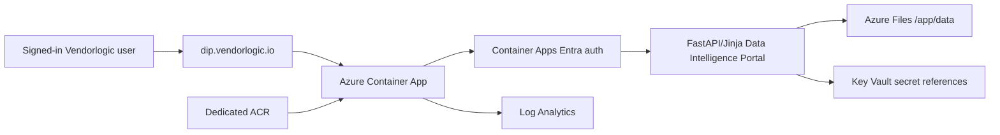

# Azure Live-Test Hosting Plan

The Data Intelligence Portal live-test stack is designed to sit alongside existing Vendorlogic/DIIaC Azure services without modifying them.

## Target

- Hostname: `dip.vendorlogic.io`
- Azure model: isolated resource group plus Azure Container Apps
- Auth: Microsoft Entra ID via Azure Container Apps built-in auth
- Roles: `Data Intelligence Portal Admin Users` and `Data Intelligence Portal Standard Users`
- Secrets: existing Key Vault `kv-diiac-vendorlogic`, DIP-specific secret names only
- Persistence: Azure Files mounted at `/app/data` for the live-test SQLite snapshot and email outbox
- SQLite live-test tuning: the active MVP database runs on local container storage, with a compact snapshot copied to Azure Files after write operations

## Architecture



## Access Model

Container Apps redirects unauthenticated browser traffic to Entra ID. The platform admits only the configured Admin and Standard groups. The app then reads the `X-MS-CLIENT-PRINCIPAL` header and treats Admin users as allowed to use `/admin` and `/audit`.

Local Docker remains unchanged: `ENTRA_AUTH_ENABLED=false` by default and `SQLITE_JOURNAL_MODE=DELETE`.

## DNS And HTTPS

The generated stack outputs:

- Container App FQDN
- Container Apps environment static IP
- `CNAME dip` target
- `TXT asuid.dip` value

After those DNS records are created, `scripts/azure/show-dns-and-bind-domain.ps1 -Bind` adds the hostname and requests a free managed certificate from Azure Container Apps. Microsoft guidance requires the subdomain CNAME to point directly at the generated Container App FQDN for managed certificate issuance.

Current live-test outputs from the first deployment:

- Container App FQDN: `ca-dip-vl-test.kindocean-6b756cbc.uksouth.azurecontainerapps.io`
- Static IP: `51.11.29.101`
- DNS CNAME: `dip` -> `ca-dip-vl-test.kindocean-6b756cbc.uksouth.azurecontainerapps.io`
- DNS TXT: `asuid.dip` -> `B01B517DF534900404CD467B96A1A1B57E73B6E8EEDF856F26751B5C518EA101`

## Testing

Local:

```powershell
docker compose run --rm app pytest -q
az bicep build --file infra/azure/main.sub.bicep
```

Azure:

```powershell
.\scripts\azure\deploy-dip.ps1 -Mode plan -InfraOnly
.\scripts\azure\deploy-dip.ps1 -Mode plan
.\scripts\azure\test-azure-dip.ps1
```

Expected smoke result:

- `/healthz` returns `200`.
- `/` is protected and returns a redirect/401/403 when not signed in.

## Production Gaps To Close Later

- Replace SQLite/local snapshot persistence with Azure Database for PostgreSQL. The Azure live-test snapshot approach is a temporary single-replica MVP setting, not a production database design.
- Add backup/restore and restore testing.
- Add Entra app roles or stronger role claims if group claim overage becomes an issue.
- Add immutable audit log export.
- Add private networking and WAF/front-door decisions where required.
- Add Key Vault-backed SMTP/API connector secrets for production KRA integrations.
- Add deployment approvals and environment-specific parameter files.
