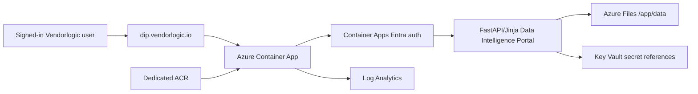

# Azure Live-Test Hosting Notes

For the full reusable deployment process, customer bootstrap script and official Azure references, see [Azure deployment guide](azure-deployment-guide.md).

The Data Intelligence Portal live-test stack is designed to sit alongside existing Vendorlogic/DIIaC Azure services without modifying them.

## Target

- Hostname: `dip.vendorlogic.io`
- Current image: `acrdipvltest01.azurecr.io/dip/app:1.0.65-cof-value-layer`
- Azure model: isolated resource group plus Azure Container Apps
- Auth: Microsoft Entra ID via Azure Container Apps built-in auth
- Roles: `Data Intelligence Portal Admin Users` and `Data Intelligence Portal Standard Users`
- Secrets: existing Key Vault `kv-diiac-vendorlogic`, including `dip-entra-client-secret` and the shared DIIaC OpenAI secret reference `diiac-openai-api-key`
- KRA Live showcase AI: `openai_direct` using model `gpt-5.4`; summaries remain human-review-required
- Live showcase preconfiguration: built-in customer packs are applied on startup with `AUTO_APPLY_CUSTOMER_PACKS=true`
- Sizing: `2.0` CPU / `4Gi` memory for the COF Autopilot, PDF export and email-outbox cycle
- Persistence: Azure Files mounted at `/app/data` for the live-test SQLite snapshot and email outbox
- SQLite live-test tuning: the active pilot database runs on local container storage, with a compact snapshot copied to Azure Files after write operations
- COF reporting: client names default to redacted customer-facing labels through `DIP_COF_CLIENT_NAME_MODE=redacted`; approved live names can be supplied through `DIP_COF_CLIENT_NAME_MAP_JSON` without changing Azure resources.
- COF Autopilot profile: official source refresh, deterministic classification, approved read-only retrieval, report export, file-outbox email and audit logging are enabled. Live customer-source KRA research runs in a rotating batch of `3` customers per cycle on the current Consumption limit, with `DIP_NOTICE_PAGE_LIMIT=10`, `DIP_NOTICE_MAX_PAGES=1` and `DIP_NOTICE_LOOKBACK_DAYS=45`. Broad market sweep remains off through `DIP_AUTOPILOT_MARKET_SWEEP_ENABLED=false` so the current Container App does not overload.

## Architecture



## Access Model

Container Apps redirects unauthenticated browser traffic to Entra ID. The platform admits only the configured Admin and Standard groups. The app then reads the `X-MS-CLIENT-PRINCIPAL` header and treats Admin users as allowed to use `/admin` and `/audit`.

Local Docker remains unchanged: `ENTRA_AUTH_ENABLED=false` by default and `SQLITE_JOURNAL_MODE=DELETE`.

Users must be assigned to one of these Entra security groups before sign-in:

- `Data Intelligence Portal Admin Users`: full portal access including `/admin` and `/audit`
- `Data Intelligence Portal Standard Users`: normal portal access only

The Entra app registration is configured with `groupMembershipClaims=SecurityGroup` so Container Apps and the FastAPI app receive security-group claims during sign-in.

## DNS And HTTPS

The generated stack outputs:

- Container App FQDN
- Container Apps environment static IP
- `CNAME dip` target
- `TXT asuid.dip` value

After those DNS records are created, `scripts/azure/show-dns-and-bind-domain.ps1 -Bind` adds the hostname and requests a free managed certificate from Azure Container Apps. Microsoft guidance requires the subdomain CNAME to point directly at the generated Container App FQDN for managed certificate issuance.

Once the managed certificate exists, the live-test parameter file enables `customDomainBindingEnabled` and references the managed certificate name so normal IaC deployments preserve the hostname.

Current live-test outputs from the first deployment:

- Container App FQDN: `ca-dip-vl-test.kindocean-6b756cbc.uksouth.azurecontainerapps.io`
- Static IP: `51.11.29.101`
- DNS CNAME: `dip` -> `ca-dip-vl-test.kindocean-6b756cbc.uksouth.azurecontainerapps.io`
- DNS TXT: `asuid.dip` -> `B01B517DF534900404CD467B96A1A1B57E73B6E8EEDF856F26751B5C518EA101`

## Testing

Local:

```powershell
docker compose run --rm app pytest -q
az bicep build --file infra/azure/main.sub.bicep
```

Azure:

```powershell
.\scripts\azure\deploy-dip.ps1 -Mode plan -InfraOnly
.\scripts\azure\deploy-dip.ps1 -Mode plan
.\scripts\azure\test-azure-dip.ps1
```

Expected smoke result:

- `/healthz` returns `200`.
- `/` is protected and returns a redirect/401/403 when not signed in.
- `/admin` shows local/remote health, source health, portal connector health, Entra status, email status, KRA runtime and the autonomous COF workflow runner for Admin users. The full cycle queues a background run, produces a PDF report export, stores/emails it through the configured delivery mode and shows queued/running/completed/failed status after refresh.
- For live operations, the image includes `/app/scripts/run-admin-cycle.sh`, a no-argument maintenance script that runs the same full-cycle workflow inside the active container and persists the SQLite snapshot. This is useful for validating a customer presentation cycle from Azure CLI when browser auth is not convenient.

## Production Gaps To Close Later

- Replace SQLite/local snapshot persistence with Azure Database for PostgreSQL. The Azure live-test snapshot approach is a temporary single-replica pilot setting, not a final production database design.
- Add backup/restore and restore testing.
- Add Entra app roles or stronger role claims if group claim overage becomes an issue.
- Add immutable audit log export.
- Add private networking and WAF/front-door decisions where required.
- Add Key Vault-backed SMTP/API connector secrets for production KRA integrations.
- Decide whether customer production environments should reuse a shared AI secret or receive customer-specific keys, budgets and audit controls.
- Add deployment approvals and environment-specific parameter files.
